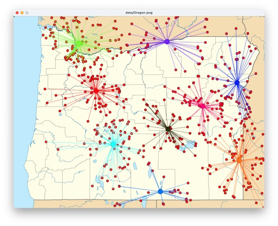

# Wildfire

Clustering historical wildfire location data.

Project for CS 210 students, University of Oregon. 
Instructions for students in
[docs/HOWTO.md](docs/HOWTO.md).

Learning objectives: 

- Successive approximation as a fundamental algorithmic technique
- k-means clustering as an example of successive approximation
- Parallel array structures (lists with matching indexes)
- Incremental construction of an application with complex data 
  structures, with testing on small example data sets

This project incorporates a fork of John Zelle's `graphics.py` 
module, which carries a GPL license, so this project is necessarily 
also covered by GPL.  I will substitute CC-by-SA when and if I
produce a "cleanroom" implementation of the needed functionality 
from `graphics.py`.  

See data/README.md for some notes on substituting 
different data sets and basemaps.  This project is used at 
University of Oregon in a CS-1 class (CS 210 at UO, equivalent to CS 
161 at other Oregon colleges and universities), approximately four 
weeks into the academic term. 

